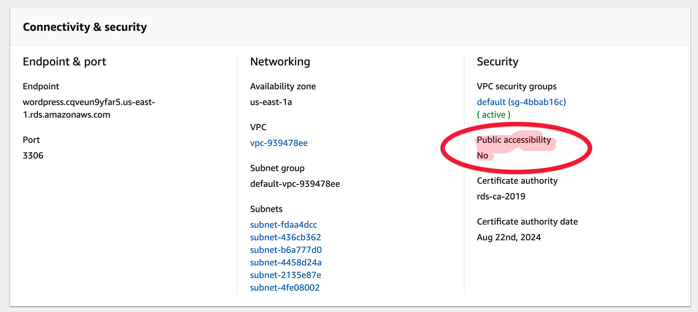
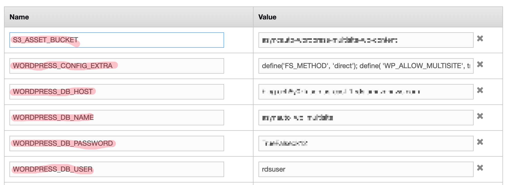

# Setup wordpress multi site
---
- keywords: [[How to get things done with switchless]], [[wordpress]]
- author: [[Alex]]
---
## Stack
- Wordpress
- Mysql
- Docker
- S3
- Amazon linux
- Elastic beanstalk

## Setup s3
We are setting up a stateless wordpress server. Wordpress installs plugins which are stored as files on the server. If you want to make the server stateless and the machine easily disposable/replacable, you need to persist the files outside the server. We are going to use S3 for that. 

1. Setup s3 bucket. 
2. Set the access to public

3. Change bucket policy to this

```
{
    "Version": "2008-10-17",
    "Statement": [
        {
            "Sid": "beanstalk",
            "Effect": "Allow",
            "Principal": {
                "AWS": "arn:aws:iam::<account>:role/aws-elasticbeanstalk-ec2-role"
            },
            "Action": [
                "s3:Get*",
                "s3:List*",
                "s3:PutObject"
            ],
            "Resource": [
                "arn:aws:s3:::<bucket>/*",
                "arn:aws:s3:::<bucket>"
            ]
        }
    ]
}
```
- change `<bucket>` to your bucket name
- change `<account>` to your 12 digit account id

## Setup Mysql DB
wordpress needs a mysql db. Go to RDS and setup a mysql db.

1. Setup a free tier db. That should be good enough for you to start with.


2. set the username and password 

3. wait for the mysql db to launch


4. change security group to public


See if you are able to connect to it using table plus


## Setup beanstalk 
Create an environment on beanstalk

**1) Choose the environment platform as docker**


**2) Disable proxy server**


From the configs, disable the proxy server. 
 
**3) Config DNS on cloudflare**
Go to cloudflare and point the dns to the beanstalk url. 


**4) Configure env variables**

```
WORDPRESS_CONFIG_EXTRA:"define('FS_METHOD', 'direct'); define( 'WP_ALLOW_MULTISITE', true );"

WORDPRESS_DB_HOST:"my_db_host",

WORDPRESS_DB_NAME:"asynauto_wp_multisite",

WORDPRESS_DB_PASSWORD:"my_db_pwd",

WORDPRESS_DB_USER:"my_db_user",

S3_ASSET_BUCKET:"my_bucket_name",
```

Get the beanstalk url and map it to the domain name you defined in the environment variable. In the above example, we used asyncauto.network. Replace that with your primary wordpress domain.

### Setup wordpress

1. clone the multisite open source repo - https://github.com/asyncauto/wordpress-multisite 
2. replace `my-s3-bucket` in `.ebextensions/wp.config` with your bucket you have created
3. commit the code.
4. setup eb-cli and deploy the code.

### Setup Wordpress Part:1

1. goto asyncauto.network and signup.
2. goto network setup


3. choose sub-domains and install


## Setup beanstalk Part:2
Replace this environment variable and apply the configuration

WORDPRESS_CONFIG_EXTRA 
```
define('FS_METHOD', 'direct');
define( 'WP_ALLOW_MULTISITE', true );
define('MULTISITE', true); 
define('SUBDOMAIN_INSTALL', true); 
define('DOMAIN_CURRENT_SITE', 'asyncauto.network');
define('PATH_CURRENT_SITE', '/'); 
define('SITE_ID_CURRENT_SITE', 1); 
define('BLOG_ID_CURRENT_SITE', 1);
define('COOKIE_DOMAIN', $_SERVER['HTTP_HOST']);

```

## Creating a new blog site
wordpress asks you to create blanket redirect of subdomains to the main site. That might not be practical if you intent to setup other services on some subdomains. 

So when you create a new sub site, say `test.asyncauto.network`, then go to cloudflare and create a C Name DNS entry for `test.asyncauto.network` to point to `asyncauto.network`. Now you will be able to access the subsite on `test.asyncauto.network`. 

`parsemonkey.com` is a subsite of `asyncauto.network`.To make that work, you need to point CName DNS `parsemonkey.com` to `asyncauto.network` on cloudflare. You will also need to change the setting on wordpress

