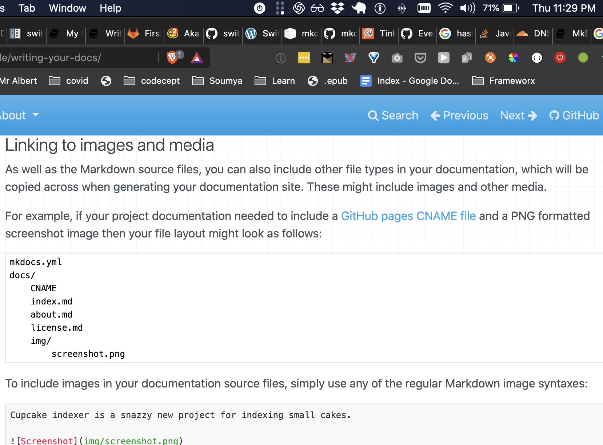

# What is the purpose of switchless? 

![[files/something reasonable.png]]
This is a screenshot. Lets see what happens here




### sub section

``` javascript

var a = test;
console.log(a);
console.log('all done');


```

